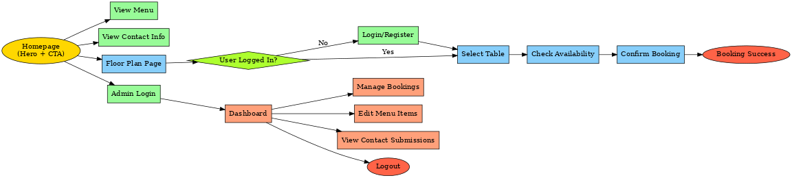

# searsteaks

## Planning Phase

### Strategy

#### Site Aims

Managing restaurant reservations efficiently is crucial for both customers and restaurant owners. Traditionally, customers call or visit restaurants to book tables, which can lead to overbookings, miscommunication, and scheduling conflicts.

This web application aims to simplify and streamline the booking process by allowing:
- Customers to register, select a table from a floor plan, and manage their reservations.
- Admins (Restaurant Owners) to manage availability, prevent double bookings, and oversee reservations from a dashboard.

By implementing a visual floor plan, user authentication, and real-time table booking, this application ensures a smoother reservation process while preventing conflicts in scheduling.

### Opportunities

During the planning phase, various features were brainstormed. Using a feasibility chart, we prioritized the most important and viable functionalities.

| Opportunity                        | Importance | Viability/Feasibility |
|------------------------------------|------------|-----------------------|
| Customer login & registration      | 5          | 5                     |
| Select a table from a floor plan   | 5          | 5                     |
| Make & modify bookings             | 5          | 5                     |
| Admin dashboard for restaurant owners | 5      | 5                     |
| Prevent double bookings            | 5          | 5                     |
| Booking confirmation email         | 4          | 4                     |
| User profile for tracking bookings | 3          | 4                     |
| Mobile responsiveness              | 5          | 5                     |
| Display available tables in real-time | 4        | 4                     |
| Payment integration for reservations | 2        | 2                     |
| Customer reviews for restaurants   | 1          | 2                     |

### Scope

To ensure the project remains feasible within the given timeframe, we categorized features into three priority levels:

#### ✅ Must-Have (MVP) Features

These are essential to launch the Minimum Viable Product (MVP) and meet the core requirements:
- User Registration & Login (Customers & Admins).
- Table Selection from a Floor Plan (Real-time availability).
- Book, Modify, and Cancel Reservations.
- Admin Dashboard to Manage Bookings & Table Availability.
- No Double Booking Prevention.

#### 🟡 Should-Have Features

Features that improve usability and enhance the experience but are not essential for MVP:
- Booking Confirmation via Email.
- User Profile to View Booking History.
- Mobile-Friendly UI with Accessibility Considerations.

#### 🔴 Could-Have (Future Enhancements)

Features that are not a priority for the initial release but could be implemented later:
- Payment Integration for Table Reservations.
- Customer Reviews & Ratings.
- Loyalty System or Discounts for Returning Customers.

### Structure & User Flow

To map out the user journey, I created a flowchart that visualizes how users interact with the system.

#### User Flow Overview

- Landing Page → Customers & admins log in or register.
- Customer Dashboard → View available tables in a floor plan.
- Select a Table → Choose date, time, and number of guests.
- Confirm Booking → Receive confirmation via email.
- Modify or Cancel Booking → Customers can adjust reservations.
- Admin Dashboard → Manage reservations & prevent double bookings.

### User Stories

#### As an Admin, I Can...
- ✅ Log in to an Admin Dashboard to manage restaurant reservations.
- ✅ View all upcoming bookings in an organized manner.
- ✅ Update table availability and prevent double bookings.
- ✅ Modify or cancel bookings on behalf of customers.
- ✅ Ensure only valid users can make reservations through authentication.

#### As an Unregistered User, I Can...
- ✅ View restaurant details without needing an account.
- ✅ Register for an account to access booking features.

#### As a Registered Customer, I Can...
- ✅ Log in securely and manage my profile.
- ✅ Browse available tables in a floor plan and pick my preferred seat.
- ✅ Select a date & time and make a table reservation.
- ✅ Modify or cancel my booking before the scheduled time.
- ✅ Receive an email confirmation of my reservation.

#### As a System, It Will...
- ✅ Prevent double bookings by checking table availability in real-time.
- ✅ Send email notifications for booking confirmations.
- ✅ Display an intuitive UI for customers to navigate smoothly.

### Skeleton: Wireframes & UX Design

To create an intuitive User Experience (UX), wireframes were designed to ensure:
- A clean interface for customers to book tables easily.
- An efficient dashboard for admins to manage reservations.
- Accessibility considerations for all screen sizes.

📥 [Wireframes Links] (Include final link once uploaded)
home page wireframe 
booking wireframe 
menu wireframe
contact wire

### Database Schema

To ensure data is well-structured and easily retrievable, the following database schema was planned:

| Table Name | Fields |
|------------|--------|
| User       | id (PK), username, email, password, phone_number, role (customer/admin) |
| Table      | id (PK), table_number, capacity, is_available |
| Booking    | id (PK), user_id (FK), table_id (FK), date, time, guests |

### Surface: Branding & UI Design

#### Color Scheme

This is the colour scheme I will use. I used coolors.co to create the colour scheme

A modern, restaurant-friendly color palette was chosen using Coolors.co, ensuring:
- ✅ High contrast for readability.
- ✅ Warm & inviting tones to reflect a comfortable dining experience.
- ✅ Consistent branding across all pages.

#### Typography

- Primary Font: Lato – Clean & readable.
- Secondary Font: Playfair Display – Elegant touch for headings.

### Final Notes

This planning phase ensures that the restaurant booking web application aligns with Agile methodology, MVC structure, and the project assessment criteria.

