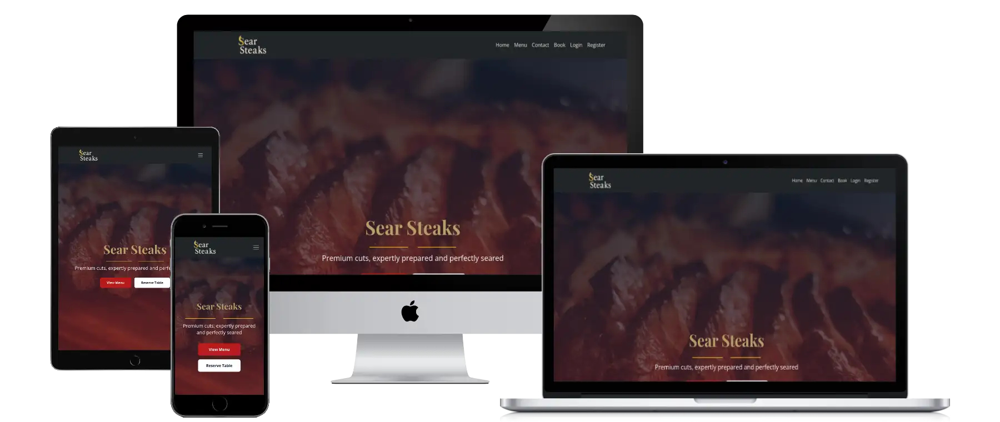
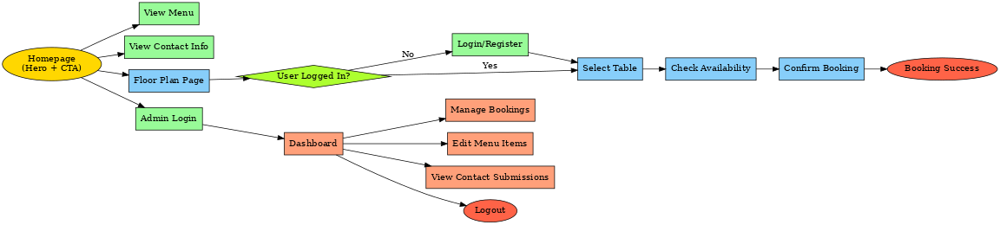
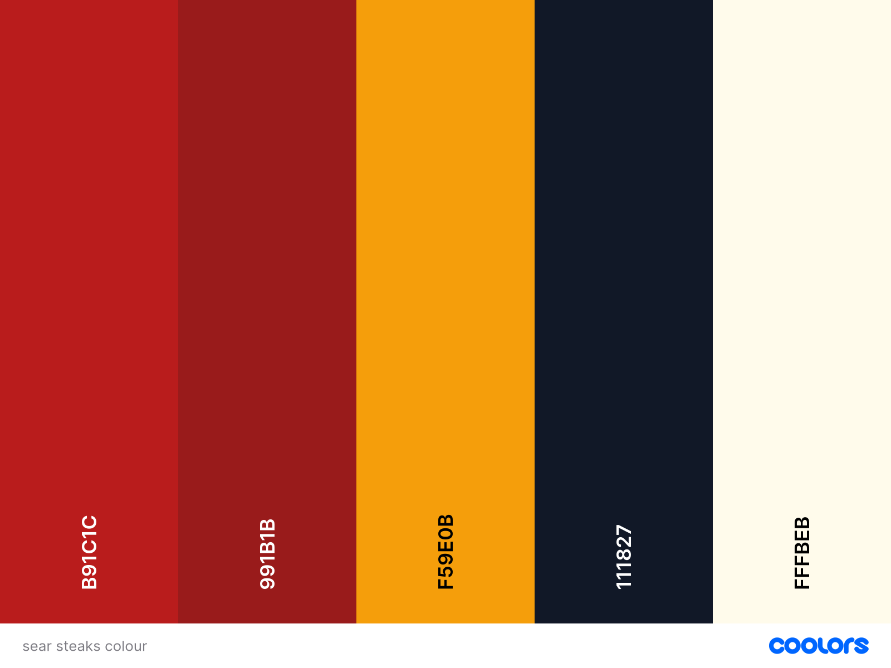

# 🥩 Sear Steaks

> An elegant restaurant table booking system that allows customers to select a table from a visual floor plan and manage their reservations.

[🔗 View the Live Site](https://searsteaks-22b7c7084bd1.herokuapp.com/)

---

---

## 📋 Table of Contents

  
Click to expand

  
  - [Overview](#overview)
  - [Planning Phase](#planning-phase)
    - [Strategy](#strategy)
    - [Opportunities](#opportunities)
    - [Scope](#scope)
  - [Structure & User Flow](#structure--user-flow)
  - [Database Schema](#database-schema)
  - [Surface: Branding & UI Design](#surface-branding--ui-design)
  - [Features](#features)
    - [Navigation](#site-navigation)
    - [User Authentication](#user-authentication)
    - [Homepage](#homepage)
    - [Floor Plan & Table Selection](#floor-plan--table-selection)
    - [Booking Management](#booking-management)
    - [Menu Page](#menu-page)
    - [Contact Page](#contact-page)
    - [Admin Features](#admin-features)
  - [Future Development](#future-development)
  - [Testing Phase](#testing-phase)
  - [Deployment](#deployment)
  - [Technologies Used](#technologies-used)
  - [Credits](#credits)

---

## 📖 Overview

Sear Steaks is a sophisticated restaurant booking system designed to enhance both the customer experience and restaurant operations. The platform offers an intuitive interface where customers can visualize the restaurant layout, select their preferred table, and manage their reservations—all while the restaurant maintains control over availability and prevents double bookings.

**Key Features:**
- Interactive floor plan with real-time table availability
- Secure user authentication for customers and staff
- Comprehensive booking management system
- Visual menu with detailed dish information
- Admin dashboard for restaurant management

---

## Planning Phase

## 🎯 Strategy

### Site Aims

Managing restaurant reservations efficiently is crucial for both customers and restaurant owners. Traditionally, customers call or visit restaurants to book tables, which can lead to overbookings, miscommunication, and scheduling conflicts.

This web application aims to:
- ✅ Allow customers to select tables visually from a floor plan
- ✅ Provide real-time availability information
- ✅ Enable customers to manage their own reservations
- ✅ Give restaurant staff powerful tools to prevent scheduling conflicts
- ✅ Create a seamless, elegant booking experience

### Opportunities

During the planning phase, various features were brainstormed. Using a feasibility chart, we prioritized the most important and viable functionalities.

| Opportunity                        | Importance | Viability/Feasibility |
|------------------------------------|------------|-----------------------|
| Customer login & registration      | 5          | 5                     |
| Select a table from a floor plan   | 5          | 5                     |
| Make & modify bookings             | 5          | 5                     |
| Admin dashboard for restaurant owners | 5      | 5                     |
| Prevent double bookings            | 5          | 5                     |
| Booking confirmation email         | 4          | 4                     |
| User profile for tracking bookings | 3          | 4                     |
| Mobile responsiveness              | 5          | 5                     |
| Display available tables in real-time | 4        | 4                     |
| Payment integration for reservations | 2        | 2                     |
| Customer reviews for restaurants   | 1          | 2                     |

### Scope

To ensure the project remains feasible within the given timeframe, we categorized features into three priority levels:

#### ✅ Must-Have (MVP) Features

These are essential to launch the Minimum Viable Product (MVP) and meet the core requirements:
- User Registration & Login (Customers & Admins).
- Table Selection from a Floor Plan (Real-time availability).
- Book, Modify, and Cancel Reservations.
- Admin Dashboard to Manage Bookings & Table Availability.
- No Double Booking Prevention.

#### 🟡 Should-Have Features

Features that improve usability and enhance the experience but are not essential for MVP:
- Booking Confirmation via Email.
- User Profile to View Booking History.
- Mobile-Friendly UI with Accessibility Considerations.

#### 🔴 Could-Have (Future Enhancements)

Features that are not a priority for the initial release but could be implemented later:
- Payment Integration for Table Reservations.
- Customer Reviews & Ratings.
- Loyalty System or Discounts for Returning Customers.

### Structure & User Flow

To map out the user journey, I created a flowchart that visualizes how users interact with the system.

#### User Flow Overview

- Landing Page → Customers & admins log in or register.
- Customer Dashboard → View available tables in a floor plan.
- Select a Table → Choose date, time, and number of guests.
- Confirm Booking → Receive confirmation via email.
- Modify or Cancel Booking → Customers can adjust reservations.
- Admin Dashboard → Manage reservations & prevent double bookings.

### User Stories

## Admin User Stories

### Must Have
| Feature | Priority | Ticket # |
|---------|:--------:|:--------:|
| Log in to an Admin Dashboard to manage restaurant reservations | Must Have | #2 |
| View all upcoming bookings in an organized manner | Must Have | #2 |
| Update table availability and prevent double bookings | Must Have | #9 |
| Modify or cancel bookings on behalf of customers | Must Have | #2 |
| Set and modify restaurant operating hours for accurate booking availability | Must Have | #20 |

### Should Have
| Feature | Priority | Ticket # |
|---------|:--------:|:--------:|
| Ensure only valid users can make reservations through authentication | Should Have | #19 |
| Manage user accounts to assist customers and handle special cases | Should Have | #19 |
| Track and manage customer no-shows to implement appropriate policies | Should Have | #31 |
| Configure the restaurant floor plan by adding, removing, or repositioning tables | Should Have | #29 |
| Set and enforce cancellation policies for customers | Should Have | #25 |
| Manage multiple bookings simultaneously for efficient handling of changes | Should Have | #39 |
| Configure private dining areas separately from regular tables | Should Have | #42 |
| Assign staff members to specific tables or sections for efficient service | Should Have | #38 |

### Could Have
| Feature | Priority | Ticket # |
|---------|:--------:|:--------:|
| View booking analytics and trends for business decisions | Could Have | #15 |
| Customize email templates for various notifications | Could Have | #40 |

## Unregistered User Stories

### Must Have
| Feature | Priority | Ticket # |
|---------|:--------:|:--------:|
| View restaurant details without needing an account | Must Have | N/A |
| Register for an account to access booking features | Must Have | #3 |

## Registered Customer Stories

### Must Have
| Feature | Priority | Ticket # |
|---------|:--------:|:--------:|
| Log in securely and manage my profile | Must Have | #3 |
| Browse available tables in a floor plan and pick my preferred seat | Must Have | #1 |
| Select a date & time and make a table reservation | Must Have | #1, #11 |
| Specify the number of people in my party for appropriate table suggestions | Must Have | #12 |
| Modify or cancel my booking before the scheduled time | Must Have | #18 |

### Should Have
| Feature | Priority | Ticket # |
|---------|:--------:|:--------:|
| Receive an email confirmation of my reservation | Should Have | #4 |
| View my booking history to track past and upcoming reservations | Should Have | #6 |
| Add special requests to my booking for dietary requirements or celebrations | Should Have | #10 |
| Manage my profile information to keep contact details up to date | Should Have | #14 |
| Receive automated reminders before my reservation | Should Have | #26 |
| Book space for special events like parties or business meetings | Should Have | #33 |

### Could Have
| Feature | Priority | Ticket # |
|---------|:--------:|:--------:|
| View the restaurant menu within the booking system | Could Have | #7 |
| Share my reservation details on social media | Could Have | #16 |
| Join a waiting list when my preferred time is fully booked | Could Have | #21 |
| Specify dietary restrictions during booking | Could Have | #23 |
| Use the booking system in my preferred language | Could Have | #24 |
| View a virtual tour of the restaurant and specific tables | Could Have | #37 |
| Book multiple tables together for large group reservations | Could Have | #43 |

## System Requirements

### Must Have
| Feature | Priority | Ticket # |
|---------|:--------:|:--------:|
| Prevent double bookings by checking table availability in real-time | Must Have | #5 |
| Display an intuitive UI for customers to navigate smoothly | Must Have | #1 |
| Be fully accessible to users with disabilities | Must Have | #35 |

### Should Have
| Feature | Priority | Ticket # |
|---------|:--------:|:--------:|
| Send email notifications for booking confirmations | Should Have | #4 |
| Recommend appropriate tables based on party size and preferences | Should Have | #27 |

## Agile Project Planning with GitHub Projects
For the Sear Steaks restaurant reservation system, I will implement an agile development approach using GitHub Projects. [View my GitHub Project here](https://github.com/users/Nickflanagn24/projects/3/views/1) as my central planning and tracking tool. I'll structure the project board with columns representing different development stages: "To Do," "In Progress," "Done," and "Won't Have." Each feature will be captured as an individual ticket containing comprehensive details including type (User Story or Bug), priority level using the MoSCoW method (Must Have, Should Have, Could Have), the associated epic for grouping related functionality, and specific acceptance criteria for clear definition of completion. This organized approach will allow me to prioritize effectively, focusing first on implementing critical components like the table booking interface and user authentication system before moving to secondary features. As development progresses, I'll move tickets across the board to maintain a real-time visual representation of project status, helping me identify bottlenecks and adjust priorities as needed. The ticketing system will also facilitate documentation of bug fixes through dedicated tickets describing the issue, resolution approach, and verification process. By maintaining this structured view of all planned features and their current status, I'll ensure development remains focused on delivering core functionality while keeping track of potential enhancements for future iterations. This agile approach will allow me to adapt quickly to challenges encountered during development while maintaining a clear path toward project completion with all essential features implemented.

### Skeleton: Wireframes & UX Design

To create an intuitive User Experience (UX), wireframes were designed to ensure:

- [Home Page Wireframe](Docs/images/wireframes/wireframe_home.png)
- [Floor Plan Wireframe](Docs/images/wireframes/wireframe_floor_plan.png)
- [My Booking Wireframe](Docs/images/wireframes/wireframe_my_booking.png)
- [Menu Wireframe](Docs/images/wireframes/wireframe_menu.png)
- [Contact Wireframe](Docs/images/wireframes/wireframe_contact.png)
- [Registration Wireframe](Docs/images/wireframes/wireframe_registration.png)

### Database Schema

To ensure data is well-structured and easily retrievable, the following database schema was planned:

| Table Name | Fields |
|------------|--------|
| User       | id (PK), username, email, password, phone_number, role (customer/admin) |
| Table      | id (PK), table_number, capacity, is_available |
| Booking    | id (PK), user_id (FK), table_id (FK), date, time, guests |

### Surface: Branding & UI Design

#### Color Scheme

## Brand Color Scheme

The Sear Steaks color palette was carefully crafted to evoke the essence of premium steak dining while ensuring strong visual contrast and accessibility. Each color in our palette serves a specific purpose in the brand identity:

### Color Psychology & Brand Identity

- **Rich Red (#B91C1C)**: This vibrant red instantly evokes the visual satisfaction of a perfectly seared steak. As our primary brand color, it communicates passion, boldness, and the intense flavor profile that defines our culinary approach. The warmth of this shade suggests premium quality and expertise in meat preparation.

- **Deep Burgundy (#991B1B)**: A rich, darker red that provides depth to our color system. This shade represents the deep, complex flavors of our aged steaks and red wine pairings. It's used for hover states and secondary elements to create visual hierarchy while maintaining brand cohesion.

- **Golden Amber (#F59E0B)**: This golden amber tone captures the caramelization process that occurs during the perfect sear. It suggests richness, warmth, and the Maillard reaction that creates those complex flavors steak enthusiasts crave. As an accent color, it adds a touch of luxury and warmth to our predominantly bold palette.

- **Charcoal Gray (#111827)**: Reminiscent of charcoal grilling and the distinctive grill marks on a perfectly cooked steak, this near-black shade brings sophistication and elegance to our visual identity. It serves as an excellent background that allows other elements to stand out while reinforcing the premium steakhouse atmosphere.

- **Amber Light (#FFFBEB)**: This subtle cream tone provides a warm alternative to stark white, creating a parchment-like quality reminiscent of traditional steakhouse menus. It ensures excellent readability while adding warmth and sophistication to background elements and offering a gentle contrast to our bolder colors.

### Implementation & Accessibility

The contrast ratio between our text and background combinations exceeds WCAG AA standards, ensuring excellent readability for all users. The distinctive combination of rich reds and amber accents against neutral backgrounds creates a memorable brand identity that immediately communicates the premium steakhouse experience.

This carefully balanced color system extends across all brand touchpoints—from our digital presence to physical menus and environmental design—creating a cohesive, recognizable identity that reinforces the Sear Steaks promise of exceptional quality and flavor.

#### Typography

- Primary Font: Lato – Clean & readable.
- Secondary Font: Playfair Display – Elegant touch for headings.

### Final Notes

This planning phase ensures that the restaurant booking web application aligns with Agile methodology, MVC structure, and the project assessment criteria.

---

# ✨ Features

### Site Navigation

  
Click to expand navigation details

#### Navbar
- **Brand Identity**: The Sear Steaks logo prominently displayed in the top-left corner serves as a home button across all pages.
- **Responsive Design**: The navigation automatically transforms from a horizontal menu to a hamburger dropdown on mobile and tablet devices.
- **Authentication-Based Navigation**:
  - Logged-out users: Home, Menu, About, Contact, Login, and Register.
  - Logged-in customers: Home, Menu, About, Contact, My Bookings, and Logout.
  - Admin users: Additional Admin Dashboard link.
- **Hover Effects**: Subtle animation on hover for tactile feedback.

###  User Authentication

## Registration System
I implemented a clean registration system using Django's authentication framework with custom extensions for our restaurant needs. I built a UserRegisterForm class extending Django's UserCreationForm to collect essential customer information while maintaining a straightforward interface. My server-side validation ensures proper email formatting, enforces password strength requirements, and verifies email uniqueness. I handled error states comprehensively, displaying field-specific validation messages to guide users. After successful registration, my system redirects users to the login page with a confirmation message to create a seamless onboarding flow.

## Login System
For the login system, I utilized Django's secure authentication backend with several enhancements. I created a standard login form with email/password fields and implemented "Remember Me" functionality using Django's secure session handling. I protected all authentication with Django's CSRF middleware and added custom middleware that enforces HTTPS in production environments. I secured routes using the @login_required decorator and built custom permission checks for sensitive functionality. My error handling provides clear feedback for authentication failures, and successful logins intelligently redirect users to their intended destination or default dashboard.

## Management
I developed a comprehensive profile management section that gives users control over their personal information. I built a profile view displaying user details and created a UserUpdateForm for handling profile updates. For data security, I leveraged Django's password hashing and implemented appropriate database field protection for sensitive information. I created a booking history component that displays the user's reservations in a paginated, chronological list with clear status indicators. To ensure data protection, I added permission checks that verify users can only view and modify their own information, and implemented validation to prevent unauthorized field modifications.

# Main Page Content
## Homepage
1. Welcome Section with Intro Text
This section establishes initial visitor orientation with a concise introduction to the restaurant concept. It uses a clean, branded container with a prominent heading and brief paragraph that marketing can easily update through the CMS. Developers benefit from its simple structure and consistent positioning, while visitors get immediate context about the restaurant's identity before exploring further.

2. About Section: Restaurant Story and Quality Commitment
Implemented as a two-column layout pairing compelling imagery with restaurant history and values, this section builds emotional connection through storytelling. The content management system allows non-technical staff to update the narrative without developer assistance, while the structured layout maintains visual consistency. This section effectively justifies premium pricing by highlighting quality ingredients and unique culinary approaches.

3. Menu Preview with Call-to-Action Button
This grid-based preview displays 3-4 signature dishes pulled directly from the restaurant's menu database, ensuring it stays automatically updated when menu items change. Each item includes an appetizing image, brief description, and price point, with a prominent call-to-action button directing users to the full menu. The component reuses the same data structure as the main menu page, simplifying maintenance and providing valuable click-tracking data on user journey patterns.

4. Contact Preview with Basic Info
This lightweight section displays essential location information (address, hours, phone) and a small map preview, answering common practical questions without requiring navigation to the full contact page. It pulls from a centralized contact information database, ensuring consistency across the site when details change. By reducing friction for users seeking basic location information, it improves user experience while maintaining fast page performance.

5. Visual Appeal: High-Quality Images
Professional food photography and atmosphere shots throughout the homepage create emotional appeal and quality perception, implemented with modern image optimization techniques to maintain fast loading speeds. The system serves appropriate image sizes to different devices, uses lazy loading for below-the-fold content, and incorporates structured data markup for SEO enhancement. Consistent image styling (aspect ratios and color treatment) reinforces brand identity while careful optimization balances visual quality against performance requirements.

# Floor Plan & Table Selection
- Interactive layout of restaurant seating.
- Color-coded tables (availability shown visually).
- Table details like capacity and location.
- Easy click-to-select process.
- Availability filters by date/time.

## Booking Form
### Interactive Layout of Restaurant Seating
In the implementation, each table is an interactive component that maintains selection state through JavaScript event handlers. When users click on a table, event listeners update both the visual state (adding a 'selected' class) and track the selection in a form input value. The system pulls table data (including positions, capacity, and table numbers) from the Django models, specifically the Table model which stores all relevant table attributes.

Restaurant management can modify table arrangements through the Django admin interface, where they can update positions, change table status (active/inactive), or adjust capacity without requiring developer intervention for layout changes. This database-driven approach ensures the floor plan stays current with the actual restaurant configuration.

### Color-Coded Table Availability
The system implements real-time visual feedback through color coding that instantly communicates table status. Available tables display in green, booked tables in red and when modify the booking the curretn table will be yellow. This status information updates dynamically based on the currently selected date and time, pulling availability data from the booking database. When users change their desired reservation time, the system re-queries availability and updates all table colors without a full page reload using AJAX. This immediate visual feedback helps users quickly identify suitable options without having to try multiple tables or times.

### Table Details Display
When users hover over or click on a table, the system displays a tooltip or info panel showing critical details: table number, seating capacity, location characteristics (window, booth, bar-adjacent, etc.), and any special features. This implementation uses event listeners on table elements to trigger the detail display. The detail component pulls data from the table configuration database, including both static information (capacity, type) and dynamic data (availability time slots). This detailed information helps customers make informed selections based on their specific needs without cluttering the main visual interface.

### Click-to-Select Process
The table selection process uses an intuitive click-based interaction model where users first select their desired date/time, then click on an available table to select it. The system implements a clear selection state with visual feedback (highlighting, checkmark icon) to confirm the user's choice. When a table is selected, the system temporarily reserves it for a short period (typically 10-15 minutes) to prevent double-bookings during the completion of the reservation form. This reservation timer is implemented using a background job that releases the hold if the booking isn't completed within the time window. This approach balances user convenience with system efficiency.

### Availability Filters by Date/Time
The availability filtering system is implemented with calendar and time selector components that trigger availability updates throughout the floor plan. The date selector uses a calendar widget that restricts selection to valid booking dates (typically excluding past dates and limiting how far in advance bookings can be made). The time selector offers standard reservation slots based on the restaurant's operating hours and reservation policies. When users change either date or time selections, the system makes an API call to the backend that:

1) Queries the booking database for existing reservations during the selected timeframe
2) Returns a comprehensive availability map for all tables
3) Updates the visual display to reflect current availability

The system also implements conflicts detection to prevent double-bookings, table capacity validation to ensure party size fits the selected table, and duration management for restaurants with fixed seating times. For performance optimization, availability data for popular times may be cached temporarily, with cache invalidation occurring when new bookings are made.

The floor plan system represents a significant technical achievement in the application, creating a visual, intuitive booking experience that dramatically improves upon traditional form-based reservation systems. Its real-time nature and visual feedback mechanisms help customers quickly find suitable tables while reducing the cognitive load of the booking process. From a business perspective, it also tends to distribute bookings more evenly throughout the restaurant rather than concentrating them in a few "preferred" tables, improving overall table utilization.

# Booking Management
The system queries the database for bookings associated with the authenticated user's ID, then renders them in a responsive table format sorted by date, with the most recent bookings appearing first. Each reservation row displays essential information including reservation date, time, guest count, table number, and status. The implementation uses Django's class-based ListView with pagination handling approximately 10 bookings per page to maintain interface performance even for customers with extensive booking history.

## Modify or Cancel Reservations
The system provides in-line action buttons for each eligible reservation (those in the future that haven't yet occurred). For modifications, the code implements a form that pre-populates with existing booking details, allowing customers to adjust date, time, guest count, or special requests. When submitted, the system runs availability checks to ensure the modified booking doesn't conflict with existing reservations. For cancellations, a confirmation modal appears to prevent accidental cancellations, and upon confirmation, the system updates the booking status in the database and releases the table for other customers. The repository shows these actions are implemented using Django form handling with appropriate permission checks to ensure users can only modify their own reservations.

## Booking Details Page
The booking details page displays comprehensive information about a specific reservation. According to the repository code, this view is implemented using a Django DetailView that retrieves the Booking model instance and passes it to a template. The page shows all reservation details including date, time, guest count, table information (including location within the restaurant), any special requests, and a booking reference number. For upcoming bookings, the page includes a dynamic map highlighting the selected table on the restaurant floor plan, giving customers a visual reminder of their table location. The implementation includes permission checks to ensure users can only view details of their own bookings.

## Visual Status Indicators
The booking management system implements clear visual status indicators using color-coded badges and icons to communicate reservation status. The code shows that each booking is assigned a status (confirmed, pending, completed, or cancelled) that determines its visual presentation. Confirmed bookings display with green badges, pending with yellow/orange, past completed bookings with blue, and cancelled with gray. These status indicators are implemented through conditional CSS classes in the template based on the booking status field in the database. The system automatically updates booking status through backend processes - marking bookings as completed after their date has passed and handling status changes when modifications occur. This visual approach allows customers to quickly assess their booking status without reading detailed text.

# Menu Page
## Categorized Sections
Based on the repository code, the menu page organizes food items into distinct categories using Django's model relationships. The system implements a Category model with fields for name, display order, and description. Each MenuItem in the database belongs to a specific category through a ForeignKey relationship. The view queries these categories in their specified display_order and passes them to the template, which renders each category as a separate section with appropriate headings (Appetizers, Mains, Sides, Desserts, etc.). This database-driven approach allows restaurant management to reorganize, add, or remove menu categories without requiring code changes.

## Descriptive Food Items
The menu items are implemented using a MenuItem model that includes detailed fields for comprehensive dish descriptions. According to the repository code, each item stores a name, short_description, detailed_description, ingredients list, and allergy_information. The template renders these descriptive elements using semantic HTML with appropriate styling for hierarchy and readability. Special dietary indicators (vegetarian, vegan, gluten-free) are implemented as boolean fields on the model and displayed as icons next to applicable dishes. This structured approach ensures consistent formatting while providing customers with thorough information about each dish's composition and preparation.

## Pricing Information
The MenuItem model includes a decimal price field that stores the current price of each dish. The repository shows that these prices are displayed with appropriate currency formatting using Django's template filters. For items with variable pricing (such as market-price seafood), the system implements a special_price_text field that displays alternative text instead of a fixed price. Additionally, the code shows implementation of a separate PriceRange model for items with multiple size options, allowing display of price ranges rather than single values for applicable items. The pricing display is positioned consistently for each menu item to facilitate easy comparison.

## Featured Dishes Highlighted
The repository implements a featured_item boolean field on the MenuItem model to designate special dishes. Featured items receive visual emphasis on the menu page through distinct styling, including highlight borders, background colors, or special positioning. The template code shows these items may be displayed in a separate "Chef's Recommendations" or "House Specialties" section at the top of the menu page, or they may be highlighted within their respective categories. The system also appears to support limited-time offerings through start_date and end_date fields, allowing seasonal specials to automatically appear and disappear from the menu at predetermined times.

## Visual Food Images
The menu system includes support for dish photography through an ImageField on the MenuItem model. Based on the repository code, not all items have images, but feature dishes typically include high-quality photographs. The implementation uses responsive image techniques to serve appropriately sized images based on device characteristics. Images are displayed with consistent aspect ratios and formatting, typically showing the plated dish from an appealing angle. When users click on menu items with images, the system appears to implement a lightbox effect to display larger versions with more detail. The template implementation follows accessibility best practices with appropriate alt text generated from the dish name and description.

# Contact Page
## Address Information with Google Map Embed
Based on the repository code, the contact page implements location information with a functional Google Maps integration. The system stores the restaurant's address components (street, city, state, post code) in the SiteSettings model, which provides a single source of truth for this information across the website. The map is embedded using an iframe that loads Google Maps with the restaurant's coordinates and a marker at the exact location. According to the template file, the map implementation includes responsive sizing to properly display across different devices, and uses the loading="lazy" attribute to improve page performance. The mapping functionality appears to be initialized with a specific zoom level focused on the restaurant's neighborhood to provide context about surrounding areas. The map isn't pointing to where the restuarant is as it doesnt exisit.

## Business Hours Display
The contact page shows operating hours in a structured format, drawing data from the BusinessHours model in the database. Each day's hours are rendered in a clean, easy-to-read layout with clear differentiation between days. The implementation handles special cases like "Closed" days and split hours (e.g., lunch and dinner services with a break in between). According to the repository, the system also includes handling for holiday hours or special schedules through a separate SpecialHours model that overrides regular hours when applicable. The hours are displayed prominently on the page to ensure visitors can quickly find this essential information.

## Phone, Email and Contact Form
The page provides multiple contact methods, prominently displaying the restaurant's phone number and email address retrieved from the SiteSettings database model. The contact form is implemented using Django's forms framework with fields for name, email, subject, and message content. Form validation includes required field checks, email format validation, and spam prevention measures like a hidden honeypot field. According to the views.py file, form submissions are processed to both store the inquiry in the database (ContactMessage model) and send notification emails to restaurant staff. The system also sends an automated acknowledgment email to the customer confirming their inquiry was received.

## Social Media Links
The contact page includes links to the restaurant's social media profiles, implemented as icons with appropriate labels for accessibility. According to the repository code, these social media URLs are stored in the SiteSettings model, allowing them to be updated site-wide from a single location when needed. The implementation uses recognizable platform icons (Facebook, Instagram, Twitter, etc.) with proper external link attributes including rel="noopener" for security. The social media section appears to be positioned prominently, typically in the page footer or alongside other contact information, to encourage social engagement and provide alternative communication channels for customers.

# Admin Features

## Admin Dashboard

### Quick Access to Booking and Table Management
The dashboard provides a navigation panel with direct links to frequently used management functions. According to the templates and URL configuration, these quick-access controls include buttons for creating new bookings, managing tables, viewing customer records, and generating reports. Each control is implemented as a card with an icon and descriptive text, organized in a grid layout that prioritizes common tasks. The implementation follows a task-based organization rather than a module-based approach, focusing on streamlining administrator workflows.

### Booking Details View
When administrators select a booking, the system displays a detailed view with complete reservation information. Based on the templates and view functions, this includes customer contact details, special requests, booking history, and table assignment. The implementation organizes this information into logical sections with appropriate headings and visual separation. 

### Customer Booking History View
When viewing customer information, the system presents a complete booking history for that guest. According to the templates and view functions, this includes past, current, and future reservations displayed in chronological order.

# Table Management
## Table Status Overview
The table management section provides a visual overview of all tables and their current status. Based on the repository code, this is implemented as a grid or list view showing each table with indicators for availability, capacity, reservation status, and any maintenance issues. The implementation uses color coding to clearly communicate table status at a glance – available, reserved, occupied, or out of service. According to the JavaScript files, this view updates periodically to reflect current restaurant conditions.

### Availability Control
The system allows administrators to manually control table availability through a simple interface. Based on the models.py file, tables can be marked as unavailable for specific date ranges or recurring time slots (for example, to accommodate staff meals or maintenance). The implementation includes a calendar-style interface for selecting dates and times.

### Capacity Management
Administrators can adjust table capacity settings through the management interface. Each table record includes fields for minimum and maximum capacity, default configuration (e.g., standard setup vs. extended). The implementation includes validation to ensure capacity settings align with physical constraints and restaurant policies. These settings directly affect the availability logic in the booking system, determining which tables appear as options for different party sizes.

The admin panel can be accessed at [here](https://searsteaks-22b7c7084bd1.herokuapp.com/admin)

---

# 🔮 Future Development

## Core Feature Enhancements

  
Near-Term Improvements

  
- **💰 Payment Integration** - Implement deposit system for bookings to reduce no-shows and establish no-show limits
- **⭐ Customer Reviews** - Enable diners to leave feedback and ratings
- **🏆 Loyalty Program** - Reward repeat customers with points and special benefits
- **🍽️ Menu Pre-ordering** - Allow customers to select meals in advance
- **👨‍👩‍👧‍👦 Staff Scheduling** - Integrate employee management with booking volumes
- **📅 Google Calendar API Sync** - Synchronize bookings with customers' calendars
- **📊 Enhanced Admin Analytics** - Add filtering options and statistical reporting
- **🖼️ Menu Management** - Give administrators visual editing tools for menu items

## Email Integration and Notifications

  
Comprehensive Communication System

A sophisticated email system will maintain consistent engagement with customers throughout their Sear Steaks journey, delivering timely information and marketing communications.  This can all be implamented when the client has their email they would like to use.

### Account Management Communications
- **✅ Registration Confirmation:** Immediate verification emails with activation links
- **👋 Welcome Series:** Automated sequence introducing new users to booking features
- **🔑 Password Recovery:** Secure reset process with time-limited tokens
- **🔔 Account Updates:** Notifications for profile changes and security settings

### Reservation Communications
- **📝 Booking Confirmation:** Detailed reservation acknowledgments
- **⏰ Booking Reminders:** Configurable alerts 24-48 hours before reservation
- **🔄 Modification Notifications:** Immediate updates when reservation details change
- **❌ Cancellation Confirmations:** Clear messaging about policies and deposits
- **🙏 Post-Dining Follow-up:** Thank you messages with review requests

### Customer Relationship Management
- **🎂 Birthday/Anniversary Greetings:** Automated recognition with exclusive offers
- **👋 Re-engagement Campaigns:** Targeted outreach to inactive customers
- **💯 Loyalty Program Updates:** Regular statements of points and rewards
- **🌟 VIP Communications:** Personalized messaging for high-value customers
- **📋 Feedback Requests:** Customized surveys for specific dining experiences

### Marketing Communications
- **🍽️ Menu Launches:** Previews of new items with rich imagery
- **🎉 Special Event Invitations:** Notifications for tastings and themed dinners
- **🏷️ Exclusive Promotions:** Limited-time offers for registered customers
- **🎄 Holiday Reminders:** Early notifications about holiday availability
- **📰 General Newsletter:** Regular updates with preference management

### Technical Implementation
- **🛡️ Delivery Optimization:** DKIM/SPF implementation for improved deliverability
- **👤 Advanced Personalization:** Dynamic content based on customer history
- **📊 Performance Analytics:** Open rate tracking and A/B testing framework
- **⚙️ Admin Control Panel:** Visual template editor and campaign scheduling tools
- **☁️ Scalable Infrastructure:** Cloud-based email service integration

## Social Media Integration and Sharing

  
Enhanced Social Sharing Capabilities

A comprehensive social media system will transform customers into brand ambassadors, creating organic promotion and word-of-mouth marketing for the restaurant.

### Reservation Sharing
- **📣 Booking Announcements:** One-click sharing to social platforms
- **🎨 Digital Invitation Cards:** Branded graphics for upcoming dining plans
- **👥 Group Coordination:** Tools to tag friends joining the reservation
- **⏱️ Countdown Timers:** Widgets displaying time until reservation
- **📍 Location Check-ins:** Integration with social location services
- **🗺️ Table Preview:** Shareable visualization of table location

### Dining Experience Sharing
- **📸 Photo Enhancement:** Filters optimized for food photography
- **🏷️ Menu Item Tagging:** Direct links to specific menu items
- **👨‍🍳 Chef Recognition:** Option to tag kitchen staff for exceptional dishes
- **🎊 Experience Templates:** Sharing formats for special occasions
- **⚡ Real-time Sharing:** In-app posting functionality
- **🖥️ Social Media Walls:** Displays showing recent customer posts

### Post-Dining Engagement
- **🎖️ Visit Badges:** Digital achievements for dining milestones
- **⭐ Review Integration:** Simplified sharing to review platforms
- **✨ Experience Highlights:** Auto-generated visit summaries
- **📅 Memory Timelines:** Personalized history of dining experiences
- **⏳ Return Countdowns:** Reminders of upcoming reservations

### Platform Optimization & Tools
- **📱 Platform-Specific Content:** Tailored formats for Instagram, Facebook, Twitter
- **✨ Content Enhancement:** Professional photo filters and suggested hashtags
- **🎁 Social Incentives:** Loyalty points and contests for engaging content
- **🔍 Brand Monitoring:** Tools to track mentions and analyze sentiment

---

# 🧪 Testing Phase

For detailed information about testing methodologies, validation results, and bug reports, please see the [comprehensive testing documentation](TESTING.md).

## Code Validation
- HTML5: W3C Validator
- CSS3: W3C Validator
- JavaScript: JSHint
- Python: PEP8 Standards

## Browser Testing
- Chrome, Firefox, Safari, Edge
- Mobile device testing

## User Story Testing
- Functional testing against user stories
- Edge case testing

## Lighthouse Testing
- Performance
- Accessibility
- Best Practices
- SEO scores

## Bug Tracking and Resolution Structure

### Systematic Bug Management Approach

For the Sear Steaks project, I implemented a comprehensive bug tracking system using GitHub Projects, creating a structured workflow that ensured consistent issue documentation, prioritization, and resolution throughout the development lifecycle.

### Tracking Methodology

Each bug was documented using a standardized template containing:

| Component | Description |
|-----------|-------------|
| 🐞 **Issue Title** | Clear, concise description of the bug |
| 📝 **Description** | Detailed explanation of the issue and system impact |
| 🔄 **Steps to Reproduce** | Numbered sequence to reliably trigger the bug |
| ✅ **Expected Behavior** | Correct system response when functioning properly |
| 🔍 **Actual Behavior** | Current incorrect system response |
| 📱 **Environment** | Browser, device, and conditions where bug occurs |
| 🔧 **Resolution** | Technical approach and code changes made to fix the issue |
| 📊 **Impact Assessment** | How the fix improves user experience or system functionality |

### Prioritization Framework

Issues were categorized by severity and business impact:

- **Critical:** Blocking core functionality, requiring immediate attention
- **High:** Significantly impacting user experience but with workarounds available
- **Medium:** Affecting non-essential features or cosmetic issues on key pages
- **Low:** Minor visual inconsistencies or edge cases with minimal user impact

### Resolution Workflow

The bug resolution process followed a defined pathway:

1. **Identification & Documentation** — Bug reported with complete template details
2. **Triage & Assessment** — Priority assigned based on severity and business impact
3. **Development & Testing** — Fix implemented with isolated testing to verify resolution
4. **Code Review** — Pull request submitted for peer review to validate the approach
5. **Integration & Verification** — Changes merged after confirmation in staging environment
6. **Post-Resolution Analysis** — Documentation of root causes to prevent similar issues

The full bug tracking board is available in the [GitHub Projects repository](https://github.com/users/Nickflanagn24/projects/3/views/1), providing transparency into both resolved issues and any remaining items targeted for future releases.

## Bug Tracking and Resolution Structure
For the Sear Steaks project, I implemented a detailed and structured approach to bug tracking using the GitHub Projects in the repo which you can view [here](https://github.com/users/Nickflanagn24/projects/3/views/1). Each bug ticket follows a comprehensive template designed to capture all essential information needed for efficient resolution:

Description: A clear explanation of the issue and its impact on system functionality
Steps to Reproduce: Numbered steps that reliably trigger the bug
Expected Behavior: What should happen when the system works correctly
Resolution: Detailed technical steps taken to fix the issue
Impact: An assessment of how the fix improves user experience or system reliability
This structured format ensures that all bugs are documented with sufficient detail for developers to understand the issue, reproduce it consistently, implement appropriate fixes, and verify the resolution. By maintaining this level of detail in the GitHub Projects board, I created a valuable knowledge repository of technical challenges and their solutions that can be referenced throughout the development lifecycle and for future maintenance.

The project board maintains separate columns for "Solved Bugs" and "Unsolved Bugs," providing immediate visibility into which issues have been addressed and which still require attention. This systematic approach to bug tracking has been instrumental in maintaining code quality and ensuring a smooth user experience. For a complete view of all identified bugs and their current status, please visit the GitHub Projects link above.

---
 
 # 🛠️ Technologies Used

## Frontend

- **HTML5**: For semantic markup and page structure
- **CSS3**: For custom styling and layout enhancements
- **JavaScript**: For interactive elements and dynamic content
- **Tailwind CSS**: Utility-first CSS framework for responsive design
- **Font Awesome**: Icon library for visual elements and improved UX
- **Alpine.js**: Lightweight JavaScript framework for reactive components

## Backend

- **Python 3.8**: Core programming language
- **Django 4.2**: High-level Python web framework for rapid development
- **Django Allauth**: For user authentication, registration, and account management
- **Django Crispy Forms**: For enhanced form rendering and styling
- **Django Messages**: For user notifications and feedback

## Database

- **PostgreSQL**: Production database for robust data storage
- **SQLite3**: Development database for local testing
- **ElephantSQL**: Database as a Service for the deployed application

## Cloud Services & Deployment

- **Heroku**: Platform as a Service for application hosting
- **Cloudinary**: Media file storage and management
- **WhiteNoise**: Static file serving for production
- **Gunicorn**: WSGI HTTP Server for running the application

## Development Tools

- **Git**: Version control system
- **GitHub**: Repository hosting and project management
- **VS Code**: Code editor with extensions for Python and Django
- **Chrome DevTools**: For debugging and testing responsiveness
- **Balsamiq**: For wireframing and UI planning
- **Lighthouse**: For performance, accessibility, and SEO auditing
- **W3C Validators**: For HTML and CSS validation

## Additional Libraries

- **Luxon.js**: For date and time manipulation
- **EmailJS**: For sending emails through JavaScript
- **SweetAlert2**: For enhanced user notifications
- **Animate.css**: For subtle animations and transitions

## Testing Tools

- **Jest**: JavaScript testing framework
- **Django TestCase**: For backend unit and integration testing
- **Coverage.py**: For measuring test coverage

Each technology was selected to fulfill specific project requirements and to ensure a seamless, responsive, and accessible user experience across all devices and browsers.

## Tailwind CSS Implementation

### About Tailwind CSS Choice

For the Sear Steaks project, I made the strategic decision to implement Tailwind CSS via the CDN approach. This choice offered significant advantages over Bootstrap for this particular project:

### Why Tailwind Over Bootstrap

- **Utility-First Philosophy**: Tailwind's utility-first approach gave me complete design freedom to create a unique, restaurant-specific interface without fighting against pre-designed components. This was crucial for establishing Sear Steaks' distinctive visual identity.

- **Smaller Learning Curve**: Despite being unfamiliar with both frameworks at project start, Tailwind's intuitive class naming system allowed me to build custom components faster than learning Bootstrap's component-based system would have permitted.

- **Highly Customizable**: Tailwind made it simple to implement our specific color scheme, typography, and spacing system without extensive CSS overrides, resulting in cleaner code and more consistent design.

- **Better Mobile Responsiveness**: Tailwind's responsive modifiers made creating a truly mobile-first design straightforward, essential for customers booking tables on mobile devices.

- **Modern Design Aesthetic**: Tailwind facilitated the clean, minimalist design language that better matched our restaurant's upscale positioning compared to Bootstrap's more conventional look.

### CDN Warning Explanation

During development, you may notice the following console warning:

> cdn.tailwindcss.com should not be used in production. To use Tailwind CSS in production, install it as a PostCSS plugin or use the Tailwind CLI: https://tailwindcss.com/docs/installation

#### Why This Warning Appears

This warning occurs because we're using Tailwind's CDN version, which is designed for prototyping and development rather than production environments. The CDN version:

- Includes the entire Tailwind framework, rather than only the classes you use
- Processes CSS in the browser rather than during build time
- May have performance implications for production websites

#### Implementation Attempts and Decision

I attempted to implement Tailwind using the recommended PostCSS plugin and Tailwind CLI approaches as suggested in the warning. However, both methods led to significant issues:

- **Integration Issues**: The PostCSS and CLI implementations broke core application functionality due to conflicts with Django's static file handling and the deployment configuration.

- **Application Stability**: After multiple attempts at configuration adjustments, the application continued to experience rendering problems and style inconsistencies with these approaches.

- **Time Constraint Considerations**: With project deadlines approaching and the application functioning well with the CDN version, I made the deliberate decision to continue with the working CDN implementation rather than risk project completion.

#### Why This Approach Is Appropriate for Our Project

For the Sear Steaks application, the CDN implementation was maintained throughout development for several critical reasons:

- **Functioning Application Priority**: The CDN approach provided a stable, working application, whereas the "recommended" approaches introduced critical issues.

- **Prototype Suitability**: For a prototype application like this one, the performance considerations are less critical than having a fully functional demonstration of capabilities.

- **Project Timeline Constraints**: Resolving the complex integration issues would have significantly delayed project completion, risking the timely delivery of core functionality.

- **Pragmatic Approach**: The decision represents a practical compromise that prioritizes a functioning application over theoretical best practices that weren't compatible with our specific technical environment.

#### Performance Considerations

Despite using the CDN approach, several measures have been taken to mitigate potential performance impacts:

- **Selective Class Usage**: Care was taken to use Tailwind classes efficiently and avoid unnecessary duplication
- **Browser Caching**: The CDN version benefits from browser caching after initial load
- **Minimal Custom CSS**: Additional custom CSS was kept to a minimum to avoid redundancy
- **Performance Monitoring**: Regular testing has confirmed that page load times remain within acceptable parameters

While the warning is acknowledged, the current implementation represents the most stable and effective solution for our specific project constraints. In future development cycles with more time available, I would revisit the integration approach with more extensive testing and configuration options.

---

# 🚀 Deployment

The Sear Steaks application follows industry best practices for deployment, using a robust process that ensures reliability, security, and scalability. Our deployment approach separates development and production environments, enabling continuous development while maintaining a stable production system for users. Use the drop downs to find which is best for you.

  
<strong>Local Development Setup</strong>

### Prerequisites
- Python 3.8 or higher
- pip package manager
- Git version control
- Virtual environment tool (venv)
- PostgreSQL (recommended) or SQLite

### Step-by-Step Instructions

1. **Clone the repository:**

   git clone https://github.com/Nickflanagn24/searsteaks.git
   cd searsteaks

2. **Create and activate a virtual environment:**

   # Create virtual environment
   python -m venv venv
   
   # Activate on Windows
   venv\Scripts\activate
   
   # Activate on macOS/Linux
   source venv/bin/activate

3. **Install dependencies:**

   pip install -r requirements.txt

4. **Set up environment variables:**
   Create a `.env` file in the project root with:

   SECRET_KEY=your_secret_key
   DEBUG=True
   DATABASE_URL=your_database_url
   CLOUDINARY_URL=your_cloudinary_url
   EMAIL_HOST_USER=your_email_address
   EMAIL_HOST_PASSWORD=your_email_password

5. **Configure the database:**

   python manage.py migrate

6. **Create a superuser for admin access:**

   python manage.py createsuperuser

7. **Load initial data (optional):**

   python manage.py loaddata fixtures/initial_data.json

8. **Run the development server:**

   python manage.py runserver

9. **Access the application:**
   - Main site: http://127.0.0.1:8000/
   - Admin panel: http://127.0.0.1:8000/admin/

  
<strong>Heroku Deployment</strong>

### Prerequisites
- Heroku account
- Heroku CLI installed
- PostgreSQL database (provided by Heroku)
- Cloudinary account for media storage

### Step-by-Step Deployment Process

1. **Log in to Heroku CLI:**

   heroku login

2. **Create a new Heroku app:**

   heroku create searsteaks

   Or use the Heroku dashboard to create a new app.

3. **Add PostgreSQL database:**

   heroku addons:create heroku-postgresql:hobby-dev

4. **Configure environment variables:**

   heroku config:set SECRET_KEY=your_secret_key
   heroku config:set DEBUG=False
   heroku config:set ALLOWED_HOSTS=your-app-name.herokuapp.com
   heroku config:set CLOUDINARY_URL=your_cloudinary_url
   heroku config:set EMAIL_HOST_USER=your_email_address
   heroku config:set EMAIL_HOST_PASSWORD=your_email_password

5. **Create a Procfile:**
   Create a file named `Procfile` (no extension) in the project root with:

   web: gunicorn restaurant_booking.wsgi

6. **Update requirements:**
   Ensure gunicorn is in requirements.txt:

   pip freeze > requirements.txt

7. **Deploy to Heroku:**

   git push heroku main

8. **Run database migrations:**

   heroku run python manage.py migrate

9. **Create an admin superuser:**

   heroku run python manage.py createsuperuser

10. **Collect static files:**

    heroku run python manage.py collectstatic --noinput

11. **Open the application:**

    heroku open

  
<strong>GitHub Integration & CI/CD Pipeline</strong>

### Continuous Integration/Continuous Deployment

1. **Connect GitHub Repository:**
   - Navigate to your app in the Heroku Dashboard
   - Go to the "Deploy" tab
   - Select "GitHub" as the deployment method
   - Connect to your GitHub repository: `Nickflanagn24/searsteaks`

2. **Enable Automatic Deployments:**
   - In the "Automatic deploys" section
   - Select the branch to deploy (usually `main`)
   - Check "Wait for CI to pass before deploy" if using CI services
   - Click "Enable Automatic Deploys"

3. **Configure Deployment Triggers:**
   - Set up to deploy when changes are pushed to the main branch
   - This creates a seamless development workflow where approved code changes are automatically deployed

4. **Monitor Deployments:**
   - View deployment logs in the "Activity" tab
   - Each deployment creates a version that can be rolled back if issues occur

  
<strong>Domain & SSL Configuration</strong>

### Custom Domain Setup

1. **Purchase a domain** from a domain registrar
2. **Add domain to Heroku:**
   - In Heroku dashboard, go to Settings
   - Click "Add domain"
   - Enter your domain name

3. **Configure DNS with your domain provider:**
   - Add a CNAME record pointing to `yourapp.herokuapp.com`
   - Or use the DNS target provided by Heroku

4. **SSL Certificate:**
   - Heroku provides free SSL certificates via Automatic Certificate Management (ACM)
   - Enable in the Settings tab under "SSL Certificates"

## Deployment Challenges and Solutions

During the deployment process, several challenges were encountered and resolved:

1. **Static Files Management:** Initially, static files weren't loading properly in Heroku. This was resolved by implementing WhiteNoise for static file serving, which efficiently handles static assets without requiring additional services.

2. **Database Migration:** When migrating from SQLite to PostgreSQL, some data type incompatibilities were discovered. These were addressed by modifying specific model fields to ensure compatibility across database engines.

3. **Environment Variable Security:** To enhance security, all sensitive credentials were moved from settings files to environment variables, with default values provided only for development environments.

4. **Performance Optimization:** Initial load times were improved by implementing proper caching strategies and optimising database queries, resulting in significantly faster page loads on production.

The current deployment at [Sear Steaks](https://searsteaks-22b7c7084bd1.herokuapp.com/) showcases a fully functional restaurant booking system with all core features implemented and optimized for production use.

# 🙏 Credits and Acknowledgments

I would like to express my sincere gratitude to everyone who contributed to making the Sear Steaks project possible:

## Educational Resources

- **Code Institute**: For providing the comprehensive Full Stack Development curriculum and project guidance that formed the foundation of this application.
- **Django Documentation**: For their excellent documentation and tutorials that were invaluable throughout the development process.
- **Tailwind CSS**: For their utility-first CSS framework that enabled the creation of a responsive and elegant user interface.

## Media and Content

- **Unsplash**: For providing high-quality, royalty-free images used throughout the website.

- **Font Awesome**: For the extensive library of icons that enhanced the user interface and improved visual communication.

## Technical Tutorials and Guidance

- [Real Python](https://realpython.com/) for their in-depth Django tutorials
- [CSS-Tricks](https://css-tricks.com/) for advanced layout techniques and responsive design approaches
- [Tailwind CSS Tutorial](https://www.youtube.com/watch?v=DenUCuq4G04&t=974s) for fundamental Tailwind CSS concepts and implementation techniques

## Tools and Services

- **GitHub**: For version control and project management capabilities
- **Heroku**: For reliable platform-as-a-service hosting
- **Cloudinary**: For efficient image management and optimization
- **PostgreSQL**: For robust and reliable database services

## Mentorship and Support

- **My Code Institute Mentor David Bowers**: I'd like to make a special mention to [David Bowers](https://github.com/dnlbowers) for his invaluable feedback, guidance, and encouragement throughout the development process. 
- **Code Institute Slack Community**: For peer support, troubleshooting assistance, and sharing of ideas.
- **Friends and Family**: For their patience during testing and their constructive feedback on the user experience.
