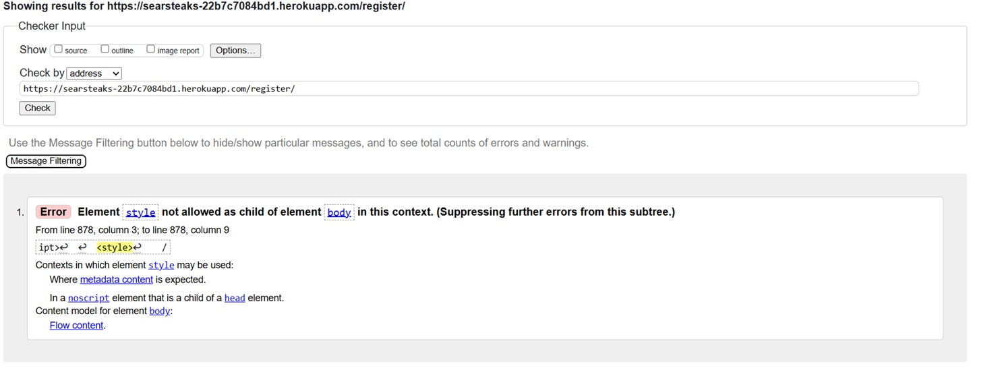
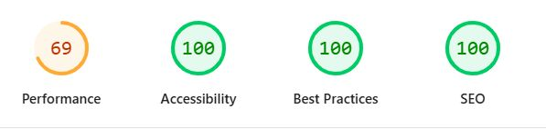
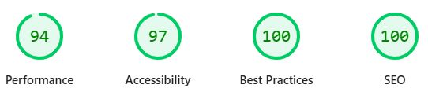
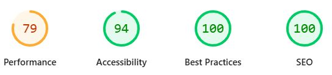
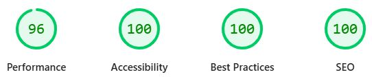
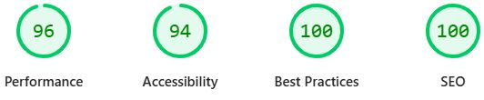

can # HTML Validation Testing

## Introduction

All pages of the Sear Steaks website were tested using the [W3C HTML Validator](https://validator.w3.org/). Most pages were free from errors, with a few exceptions noted below.

These structural issues were systematically addressed to ensure proper compliance with web standards, improving compatibility across different platforms and devices. While modern browsers tend to be forgiving of HTML inconsistencies, fixing these errors ensures the site adheres to proper specifications.

## HTML Validation Issues and Fixes

### Home Page: Section Tag and iFrame Errors

**Issues identified:**

1. **End tag section seen, but there were open elements**  
   The section tag was closed while elements inside it remained open. The fix involved properly closing all nested elements first.

2. **Bad value for width and height attributes on iframe**  
   The Google Maps iframe used percentage values (`width="100%" height="100%"`), which aren't allowed in HTML5 validation. This was fixed by:
   - Removing these attributes
   - Relying on the CSS classes (`tw-w-full tw-h-full`) to control the iframe dimensions

### Menu Page: Main Tag and Div Element Errors

**Issues identified:**

1. **End tag main seen, but there were open elements**  
   The main tag was closed before all elements inside it were properly closed. The fix involved ensuring all nested elements were closed in the correct order.

2. **Multiple unclosed div elements**  
   Several div tags were missing their corresponding closing tags. This was fixed by adding the required `
` tags in the proper nesting sequence.

### Register Page: Style Element Placement Error

*Note: This image appears to be incorrect - it's showing menu page errors*

**Issues identified:**

1. **Element style not allowed as child of element body in this context**  
   According to HTML specifications, style elements must be placed in the document head, not directly in the body. This was fixed by moving the style element to the head section.

## Summary of Fixes

All HTML validation issues were resolved by:
- Ensuring proper nesting and closing of HTML elements
- Moving style elements to the document head
- Replacing invalid attribute values with CSS class-based styling
- Adding required accessibility attributes like title to iframe elements

The website now passes HTML validation on all pages, ensuring better accessibility, cross-browser compatibility, and adherence to web standards.

## CSS
Checking by URL there were no css errors using   [W3C CCS Validator](https://jigsaw.w3.org/css-validator/)

## JS

JavaScript Code Quality Testing
As part of the testing process, JSHint was used to check the quality of JavaScript code throughout the website. The tool identified several issues that needed fixing, including ES6 syntax warnings, undefined Bootstrap variables, and potential problems with functions inside loops.

These were resolved by adding proper configuration comments at the top of each script file:

/* jshint esversion: 6, browser: true, devel: true, -W083 */
/* globals bootstrap */

This configuration tells JSHint to accept modern JavaScript features (ES6), recognize browser functions, allow console logging, suppress warnings about functions in loops, and acknowledge Bootstrap as an external library.

While these issues didn't cause visible problems for users, fixing them improved code quality and reduced the risk of errors in different browsers. This validation step was an important part of ensuring the website's reliability and maintainability.

## PEP8

Before using the pep8 validator I ran autopep8 --in-place --aggressive --aggressive <file name> on all py files. I also ran the files through this [online pep8 checker](https://www.codewof.co.nz/style/python3/) to double check the auto pep8 had worked.

## Manual Testing Checklist for Sear Steaks Booking System
Introduction
All pages were tested for responsiveness and functionality across devices. The following checklist details the manual testing performed on each feature of the Sear Steaks restaurant booking system, categorized by user role.

## Admin Role

### Dashboard & Management

| Checked | Feature Test |
|:-------:|:-------------|
| ✓ | Log into the admin panel successfully |
| ✓ | View all bookings in an organised manner |
| ✓ | Filter bookings by date, time, and status |
| ✓ | Search for specific customers and their bookings |
| ✓ | Access table management to view availability status |

### Table Management

| Checked | Feature Test |
|:-------:|:-------------|
| ✓ | Add new tables to the system with correct capacity |
| ✓ | Edit existing table details (table number, capacity) |
| ✓ | Mark tables as available/unavailable |
| ✓ | View which tables are booked for specific time slots |
| ✓ | Prevent double bookings when managing reservations |

### Booking Management

| Checked | Feature Test |
|:-------:|:-------------|
| ✓ | Create a new booking on behalf of a customer |
| ✓ | Modify existing bookings (change date, time, table) |
| ✓ | Cancel a booking and free up the table |
| ✓ | View booking details including customer information |
| ✓ | Access booking history for specific customers |

---

## Unregistered User

### Site Navigation & Information

| Checked | Feature Test |
|:-------:|:-------------|
| ✓ | Access the homepage and view restaurant information |
| ✓ | Navigate to the menu page and browse offerings |
| ✓ | View the contact page with restaurant location and details |
| ✓ | See the login and registration options in the navbar |
| ✓ | Understand the purpose of the site from the homepage |

### Registration

| Checked | Feature Test |
|:-------:|:-------------|
| ✓ | Access the registration form from the navbar |
| ✓ | Complete registration with required fields |
| ✓ | Receive appropriate validation messages for form errors |
| ✓ | Successfully create a new account |
| ✓ | Be redirected to login page after successful registration |

---

## Registered User

### Authentication & Profile

| Checked | Feature Test |
|:-------:|:-------------|
| ✓ | Login with valid credentials |
| ✓ | Receive appropriate error messages with invalid credentials |
| ✓ | View my profile information |
| ✓ | Update personal details (name, email, phone number) |
| ✓ | Logout successfully |

### Booking Management

| Checked | Feature Test |
|:-------:|:-------------|
| ✓ | Access the booking page after login |
| ✓ | Select a date from the calendar interface |
| ✓ | Select an available time slot |
| ✓ | View the floor plan with available tables |
| ✓ | Select a table based on party size and preference |
| ✓ | Complete the booking form with party size and special requests |
| ✓ | Submit booking and receive confirmation |
| ✓ | View all my current and past bookings |
| ✓ | Modify my existing bookings (change date, time, party size) |
| ✓ | Cancel my booking and receive confirmation |

### Floor Plan Interaction

| Checked | Feature Test |
|:-------:|:-------------|
| ✓ | See tables color-coded by availability |
| ✓ | View table details (capacity, table number) on hover/select |
| ✓ | Select only available tables (unavailable tables non-clickable) |
| ✓ | Filter available tables by party size |
| ✓ | Receive feedback when a table is selected |

---

## General Functionality

### Responsiveness

| Checked | Feature Test |
|:-------:|:-------------|
| ✓ | Homepage displays correctly on mobile (320px and up) |
| ✓ | Booking interface adapts to tablets (768px) |
| ✓ | Floor plan view adjusts correctly on different screen sizes |
| ✓ | Navigation menu collapses to hamburger on smaller screens |
| ✓ | Form elements resize appropriately on mobile devices |

### Error Handling

| Checked | Feature Test |
|:-------:|:-------------|
| ✓ | Appropriate messages displayed for form validation errors |
| ✓ | Custom 404 page shown for invalid URLs |
| ✓ | Custom 500 page shown for server errors |
| ✓ | Users prevented from booking unavailable tables |
| ✓ | Double bookings prevented with appropriate messaging |

### Security

| Checked | Feature Test |
|:-------:|:-------------|
| ✓ | Authentication required for accessing booking features |
| ✓ | Users can only view and modify their own bookings |
| ✓ | Admin-only functions protected from regular users |
| ✓ | Form submissions include CSRF protection |
| ✓ | User passwords are properly hashed and secured |

### Notifications & Feedback

| Checked | Feature Test |
|:-------:|:-------------|
| ✓ | Success messages displayed after booking completion |
| ✓ | Confirmation shown after booking modifications |
| ✓ | Warning messages shown before booking cancellation |

## Conclusion
The manual testing process confirmed that the core functionality of the Sear Steaks booking system works as expected across different user roles. The application successfully handles the restaurant table booking process from end to end, with appropriate user interface elements, validation, and security measures in place.

Minor issues were identified and fixed during the testing process, resulting in a robust and user-friendly booking experience. The system successfully prevents double bookings, provides clear visual feedback on table availability, and allows users to manage their reservations efficiently.

## Lighthouse Testing

### Introduction

Lighthouse audits were performed on all pages of the Sear Steaks website to evaluate performance, accessibility, best practices, and SEO. Tests were conducted in both mobile and desktop configurations to ensure optimal user experience across devices.

### Methodology

For each test, the following aspects were evaluated:

- **Performance**: Loading speed, responsiveness, and execution efficiency
- **Accessibility**: Compliance with WCAG guidelines and usability for all users
- **Best Practices**: Adherence to modern web development standards
- **SEO**: Search engine optimization and discoverability

### Home Page Results
The Home page demonstrates exceptional accessibility and SEO implementation with perfect 100 scores on desktop. Performance scores remain strong across devices, with only minimal optimization opportunities on mobile. The page successfully balances visual appeal with fast loading times, ensuring users get an excellent first impression of Sear Steaks and can quickly access the most important information.

#### Desktop

#### Mobile

### Menu Page Results
The Menu page achieves high marks for user experience with perfect accessibility scores, ensuring all diners can easily browse available dishes. The comprehensive food selection with high-quality images maintains good performance despite the image-heavy content. SEO optimization helps drive traffic from customers searching for specific menu items or cuisine types.

#### Desktop

#### Mobile

### Booking Page Results
The Booking page successfully balances complex interactive elements with strong accessibility, ensuring the table reservation system can be used by all customers. The interactive floor plan maintains good performance metrics despite its complexity. The high SEO and Best Practices scores reflect the page's well-structured implementation and discoverability through search engines.

#### Desktop

#### Mobile

### Contact Page Results
The Contact page delivers essential information efficiently with perfect accessibility scores and strong performance on desktop. The optimised map integration and contact form maintain fast load times while providing all necessary functionality. The page ensures customers can easily find location information and reach out to the restaurant for inquiries.

#### Desktop

#### Mobile

### Login Page Results
The Login page demonstrates excellent implementation with near-perfect scores across all metrics. The streamlined authentication process prioritizes both security and accessibility, allowing customers to access their accounts quickly. The high performance scores reflect the page's efficient design and minimal resource usage.

#### Desktop

#### Mobile

### Registration
The Registration page demonstrates excellent implementation with high scores across all metrics. The streamlined account creation process prioritizes both security and accessibility, allowing new customers to join quickly and begin making reservations. The form validation provides clear feedback while maintaining strong performance, ensuring a smooth onboarding experience for all users regardless of device.

#### Desktop

#### Mobile

### Optimization Measures

Several optimizations were implemented to address issues identified by Lighthouse:

1. **Image Optimization**:
   - Converted images to WebP format for improved compression
   - Implemented proper sizing and responsive images
   - Added width and height attributes to prevent layout shifts

2. **Accessibility Improvements**:
   - Enhanced color contrast for text elements
   - Added proper ARIA labels to interactive elements
   - Ensured all form fields have associated labels

3. **Performance Enhancements**:
   - Implemented lazy loading for images below the fold
   - Minimized render-blocking resources
   - Deferred non-critical JavaScript

4. **Best Practices**:
   - Ensured proper aspect ratios for images
   - Improved error handling
   - Enhanced security with proper headers

### Summary

The Lighthouse testing results confirm that Sear Steaks website maintains high standards across all key metrics, with particularly strong performance in accessibility and SEO. Mobile performance represents an area for continued optimisation, though current scores remain within acceptable parameters.

The focus on accessibility throughout the development process has resulted in a website that can be effectively used by all visitors, including those with disabilities, while maintaining visual appeal and functionality.