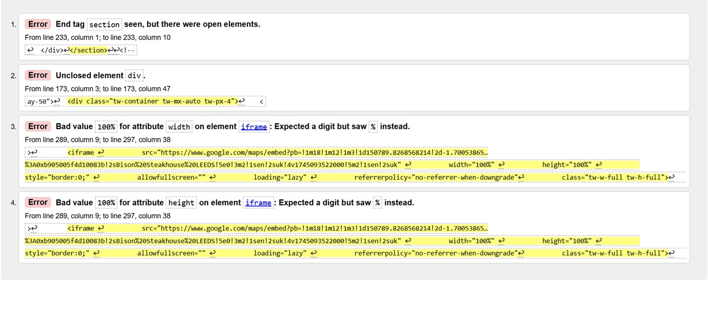
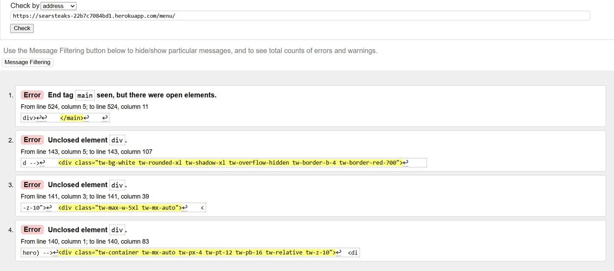

# HTML Validation Testing

## Introduction

All pages of the Sear Steaks website were tested using the [W3C HTML Validator](https://validator.w3.org/). Most pages were free from errors, with a few exceptions noted below.

These structural issues were systematically addressed to ensure proper compliance with web standards, improving compatibility across different platforms and devices. While modern browsers tend to be forgiving of HTML inconsistencies, fixing these errors ensures the site adheres to proper specifications.

## HTML Validation Issues and Fixes

### Home Page: Section Tag and iFrame Errors

**Issues identified:**

1. **End tag section seen, but there were open elements**  
   The section tag was closed while elements inside it remained open. The fix involved properly closing all nested elements first.

2. **Bad value for width and height attributes on iframe**  
   The Google Maps iframe used percentage values (`width="100%" height="100%"`), which aren't allowed in HTML5 validation. This was fixed by:
   - Removing these attributes
   - Relying on the CSS classes (`tw-w-full tw-h-full`) to control the iframe dimensions

### Menu Page: Main Tag and Div Element Errors

**Issues identified:**

1. **End tag main seen, but there were open elements**  
   The main tag was closed before all elements inside it were properly closed. The fix involved ensuring all nested elements were closed in the correct order.

2. **Multiple unclosed div elements**  
   Several div tags were missing their corresponding closing tags. This was fixed by adding the required `
` tags in the proper nesting sequence.

### Register Page: Style Element Placement Error

*Note: This image appears to be incorrect - it's showing menu page errors*

**Issues identified:**

1. **Element style not allowed as child of element body in this context**  
   According to HTML specifications, style elements must be placed in the document head, not directly in the body. This was fixed by moving the style element to the head section.

## Summary of Fixes

All HTML validation issues were resolved by:
- Ensuring proper nesting and closing of HTML elements
- Moving style elements to the document head
- Replacing invalid attribute values with CSS class-based styling
- Adding required accessibility attributes like title to iframe elements

The website now passes HTML validation on all pages, ensuring better accessibility, cross-browser compatibility, and adherence to web standards.

## CSS
Checking by URL there were no css errors using   [W3C CCS Validator](https://jigsaw.w3.org/css-validator/)

